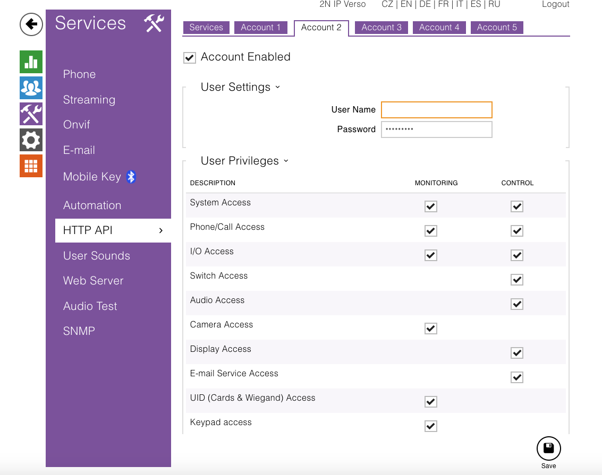

# 2N

#Description

Plugin für 2N-Gegensprechanlagen.

# Voraussetzungen

 - Finden Sie die IP-Adresse Ihrer 2N-Gegensprechanlage heraus,
 - Habe das Kamera-Plugin installiert,
 - Haben Sie ein Benutzerkonto über die Schnittstelle Ihrer 2N-Gegensprechanlage erstellt.

# Installation

Nachdem Sie das Plugin heruntergeladen haben, müssen Sie es zuerst aktivieren, wie jedes Jeedom-Plugin.
Wir müssen den Dämon starten : Überprüfen Sie, ob der Daemon in OK ist.

# Configuration

Für ein neues 2N-Gerät müssen Sie sich mit der 2N-Schnittstelle verbinden, auf die über dessen IP-Adresse zugegriffen werden kann (um die IP Ihres Geräts herauszufinden, können Sie die 2N Network Scanner-Software installieren, die 2N-Geräte erkennt, die in Ihrem Netzwerk vorhanden sind

Standardmäßig lauten Benutzername und Passwort Ihres 2N-Geräts : Administrator, 2n.

Sobald Sie mit der Schnittstelle verbunden sind, benötigen Sie:

Aktivieren Sie die Optionen für den Zugriff auf die API-Dienste :

Erstellen Sie ein Konto mit Rechten für API-Dienste :

Konfigurieren Sie die Schalter auf Ihrem Gerät :

Erstellen Sie einen Benutzer, um der Gegensprechanlage Ihre Zugangscodes zuzuweisen :

Benutzer konfigurieren :

Sobald dies erledigt ist, können Sie Ihre Ausrüstung in Jeedom mit dem Passwort und dem Benutzernamen des mit API-Rechten konfigurierten 2n-Kontos erstellen (siehe oben).
Wählen Sie in den Dropdown-Menüs die Module aus, die auf Ihrer Gegensprechanlage installiert sind oder nicht : Kamera, Fingerabdruckleser, Anti-Tearing-Modul.

Sie können direkt, ohne die Benutzeroberfläche Ihres 2N zu durchlaufen, einen Code pro Switch erstellen, der je nach Gerät verfügbar ist, im Superuser-Code.
Sie können die Codes mit einem Komma trennen, um mehrere Codes pro Schalter zuzuweisen
>**WICHTIG**
>
> Codes müssen numerisch sein

Sie können auch die Art des Signals ändern, wenn eine ungültige Karte vor dem Lesegerät vorbeigeführt wird (Einfacher Beep, Beep + Licht oder Keine).

Weisen Sie ihm ein Elternteil zu und machen Sie es sichtbar und aktiv.

Wenn Sie eine Kamera an Ihrem Gerät haben, wird über das Kamera-Plugin ein Kameraobjekt erstellt; Sie müssen es konfigurieren, damit es auf Ihrem Dashboard angezeigt wird.

>**WICHTIG**
>
> Sie müssen den Daemon neu starten, nachdem Sie ein Gerät erstellt haben, um ihm einen Identifier für API-Anfragen zuzuweisen.
> 

# Dashboard-Befehle und Informationen

Zustand :

- Standardmäßig sind die Schaltzustände mit ihren Aktionsbefehlen verknüpft; Ein Klick auf den Schalter aktiviert den Schalter (wir sehen, wie das Schaltersymbol die Farbe ändert)).
- Der Zustand der Schalter geht zurück auf die auf Ihrem Gerät verfügbaren (von 1 bis 4 .)).

- Anruf gibt Ihnen den Kommunikationsstatus, wenn Sie einen Anruf von einem anderen 2n-Gerät erhalten (kommend, empfangen usw.)).

- Abreißen zeigt an, ob ein Abreißen aufgetreten ist (bei Modellen mit Anti-Tearing-Modul).

- Bluetooth_tel_mobile signalisiert die Authentifizierung des Bluetooth-Lesers.

- Geräuschsignale erhöhte Erkennung des Geräuschpegels.

- Kartenleser : zeigt die Nummer der konfigurierten RFID-Karte an.

- Zugangscode : zeigt den eingegebenen Code an Ihrer Gegensprechanlage an.

- last_button gedrückt : zeigt die zuletzt gedrückte Sprechanlage an.

- Fußabdruck : zeigt die ID der registrierten Person an (bei Geräten mit Fingerabdruckmodul).

- Door_state zeigt ein Problem mit dem Türstatus an.

- Bewegung, meldet Bewegungserkennung über eine Kamera (nur für Modelle mit Kamera camera).

- Unbefugtes_Öffnen, signalisiert ein unbefugtes Öffnen der Tür (nur für Modelle mit Digitaleingang und Starttaste).
- Open_long, zeigt an, dass die Tür zu lange geöffnet wurde oder die Tür nicht innerhalb der vorgegebenen Zeit geschlossen wurde (nur für Modelle mit Digitaleingang).

Aufträge :

- Switch_ state (Switch-ID)) : ermöglicht es Ihnen, den Switch, dessen ID entspricht, ein- oder auszuschalten und eine Statusrückmeldung von Ihrem Switch zu erhalten.

Zusätzliche Information :

Aktivieren Sie die Protokolle im Debug-Modus, um mehr Informationen zu den von Ihrer Gegensprechanlage erkannten Ereignissen zu erhalten
