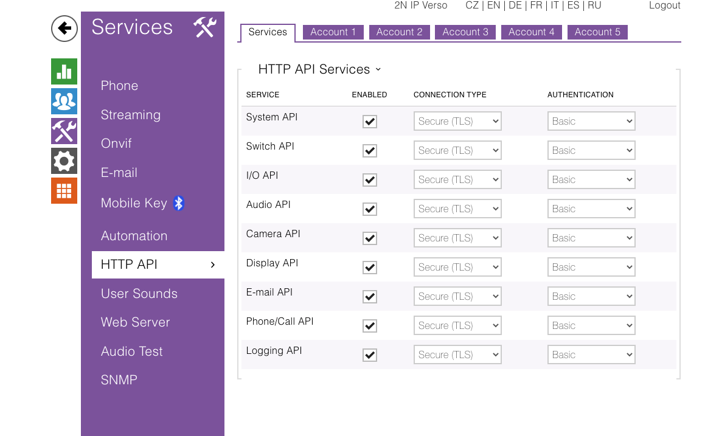
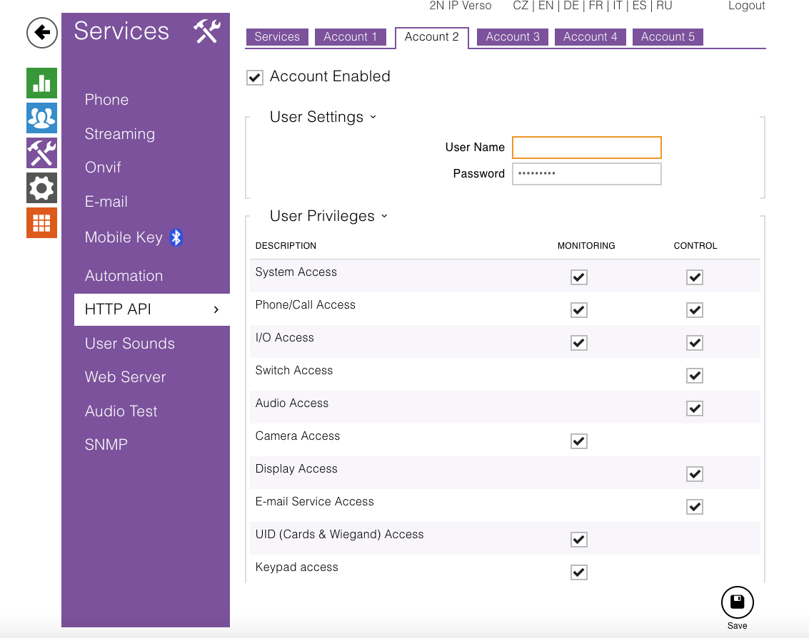
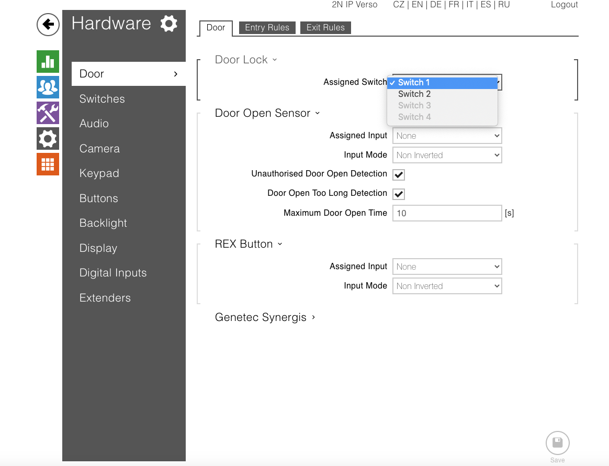
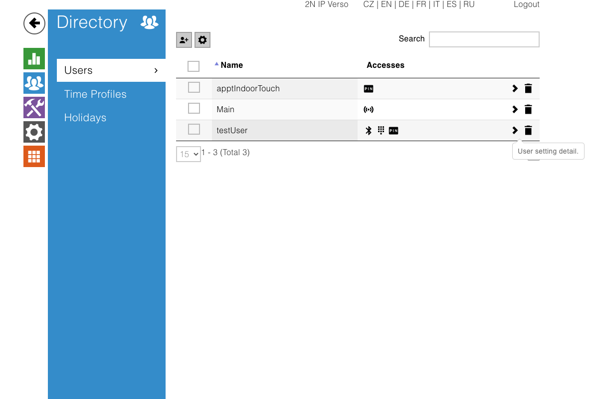
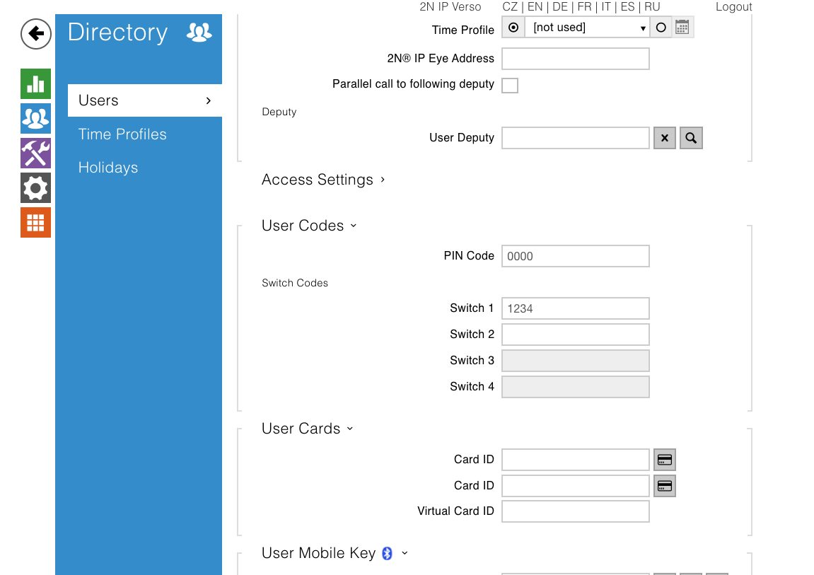
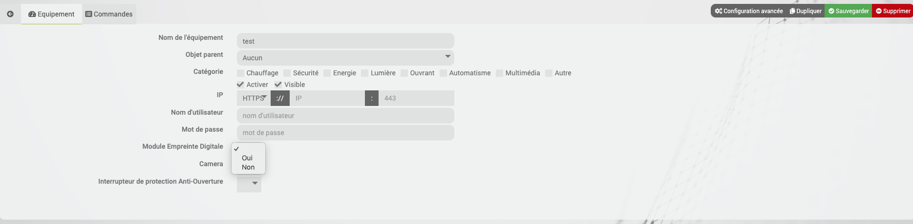
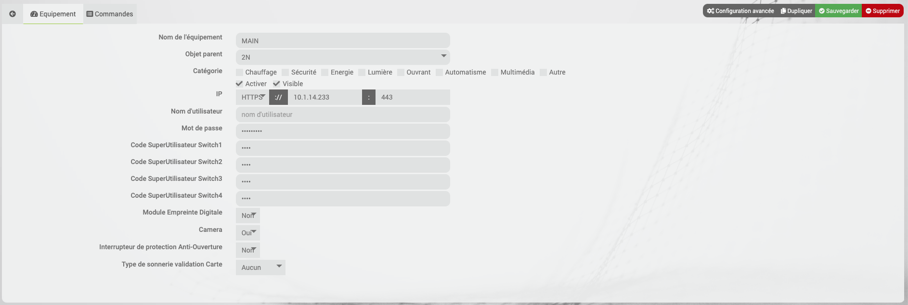

# 2N

#Description 

Plugin for 2N intercoms.

# Prerequisites

 - Know the IP address of your 2N intercom,
 - Have the camera plugin installed,
 - Have created a user account via the interface of your 2N intercom.

# Installation

After downloading the plugin, you must first activate it, like any Jeedom plugin.
You must start the daemon: check that the daemon is in OK.

# Configuration

For a new 2N device, you must connect to the 2N interface, accessible via its IP address (to know the IP of your equipment, you can install the 2N Network Scanner software, which will detect the 2N devices on your network

By default, the user name and password of your 2N device are: admin , 2n.

Once you are connected to the interface, you need to:

Activate the options to access the API services :

Create an account with the rights for the API services:

Configure the switches of your device:

Create a user to assign your access codes to the intercom :

Configure the user :

Once this is done, you can create your device in Jeedom with the password and username of the 2n account configured with API rights (see above).
In the drop-down menus, choose the modules installed or not on your intercom: Camera, Fingerprint reader, Anti-Tear Module.

You can create directly without going through the interface of your 2N, a code by Switch available according to your device, in Superuser Code. You can also change the type of signal when an invalid card is passed in front of the reader (Simple Beep, Beep + Light, or None).

Assign a parent and make it visible and active.

If you have a camera on your equipment, a camera object will be created via the Camera plugin; you will have to configure it to make it appear on your dashboard.

>**IMPORTANT**
>
>You have to restart the demon after a device creation, to give it an ID for the API requests

# Commands and information on the dashboard 

Status :

- By default, the status of the switches is linked to their action commands; clicking on the switch activates the switch (the switch icon will change color).
- The status of the switches shows the status of the switches available on your device.

- Call gives you the status of the call if you receive a call from another 2n device (coming, received etc).

- Tear off indicates if a tear off has taken place

- Bluetooth_tel_mobile reports the authentication of the Bluetooth reader.

- Noise signals an increased detection of the noise level.

- Card reader : shows the number of the configured RFID card

- Entry code : shows the code typed on your intercom

- last_button pressed : shows the last button pressed on your intercom

- Fingerprint

- Door_status : indicates a problem with the door status

- Movement, reports the detection of movement via a camera (for models equipped with camera only).

- Unauthorized_opening, reports an unauthorized door opening (for models with digital input only and a start button).
- Open_Long, reports a door opening that is too long or a failure to close the door within the allotted time (for models equipped with digital input only).

Commands:
- Switch_Status(switch id): allows you to turn on or off the switch whose id matches and get status feedback from your switch

Additional info :
Activate the logs in Debug mode to have more information on the events detected by your intercom

Translated with www.DeepL.com/Translator (free version)
