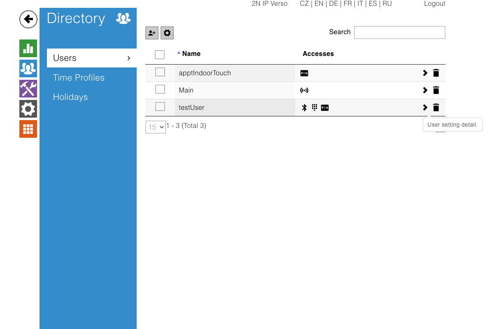

# 2N

#Description

Complemento para intercomunicadores 2N.

# Prerrequisitos

 - Descubra la dirección IP de su intercomunicador 2N,
 - Tener instalado el complemento de la cámara,
 - Ha creado una cuenta de usuario a través de la interfaz de su intercomunicador 2N.

# Installation

Después de descargar el complemento, primero debe activarlo, como cualquier complemento de Jeedom.
Debemos iniciar el demonio : compruebe que el demonio esté en buen estado.

# Configuration

Para un nuevo dispositivo 2N, debe conectarse a la interfaz 2N, accesible a través de la dirección IP de esta última (para averiguar la IP de su dispositivo, puede instalar el software 2N Network Scanner, que detectará los dispositivos 2N presentes en su red

De forma predeterminada, el nombre de usuario y la contraseña de su dispositivo 2N son : admin, 2n.

Una vez conectado a la interfaz, necesitará:

Activar las opciones para acceder a los servicios de la API :

Cree una cuenta con derechos para los servicios de API :

Configure los interruptores en su dispositivo :

Cree un usuario para asignar sus códigos de acceso al intercomunicador :

Configurar usuario :

Una vez hecho esto, puede crear su equipo en Jeedom con la contraseña y el nombre de usuario de la cuenta 2n configurada con derechos de API (ver arriba).
En los menús desplegables, elija los módulos instalados o no en su intercomunicador : Cámara, lector de huellas dactilares, módulo antidesgarro.

Puedes crear directamente sin pasar por la interfaz de tu 2N, un código por Switch disponible según tu dispositivo, en Código de Superusuario.
Puede separar los códigos con una coma para asignar varios códigos por conmutador
>**IMPORTANTE**
>
> Los códigos deben ser numéricos

También puede cambiar el tipo de señal cuando se pasa una tarjeta no válida frente al lector (Bip simple, Bip + Luz o Ninguno).

Asígnele un padre y hágalo visible y activo.

Si tiene una cámara en su equipo, se creará un objeto de cámara a través del complemento Cámara; tendrás que configurarlo para que aparezca en tu tablero.

>**IMPORTANTE**
>
> Debe reiniciar el demonio después de crear un equipo, para asignarle un identificador para las solicitudes de API.
> 

# Información y comandos del tablero

Expresar :

- De forma predeterminada, los estados del conmutador están vinculados a sus comandos de acción; al hacer clic en el interruptor se activa el interruptor (veremos que el icono del interruptor cambia de color).
- El estado de los interruptores vuelve a los disponibles en su dispositivo (de 1 a 4).

- Llamar le brinda el estado de la comunicación si recibe una llamada de otro dispositivo 2n (entrante, recibido, etc).

- Tear-off indica si se ha producido un desgarro (para modelos equipados con el módulo antidesgarro).

- Bluetooth_tel_mobile señala la autenticación del lector Bluetooth.

- Las señales de ruido aumentan la detección del nivel de ruido.

- Lector de tarjetas : muestra el número de la tarjeta RFID configurada.

- Código de entrada : muestra el código introducido en su intercomunicador.

- last_button presionado : muestra el último pulsado en su intercomunicador.

- Huella : muestra el ID de la persona registrada (para equipos equipados con el módulo de huellas dactilares).

- Door_state indica un problema con el estado de la puerta.

- Movimiento, informa la detección de movimiento a través de una cámara (solo para modelos equipados con cámara).

- Apertura_no autorizada, indica una apertura de puerta no autorizada (para modelos equipados con entrada digital solamente y un botón de inicio)).
- Open_long, indica que la puerta se abre demasiado tiempo o que no se cierra la puerta dentro del tiempo asignado (solo para modelos equipados con entrada digital).

Pedidos :

- Switch_ state (switch id) : le permite encender o apagar el interruptor cuya identificación corresponde y tener una respuesta de estado de su interruptor.

Información Adicional :

Activa los logs en modo Debug para tener más información sobre los eventos detectados por tu intercomunicador
